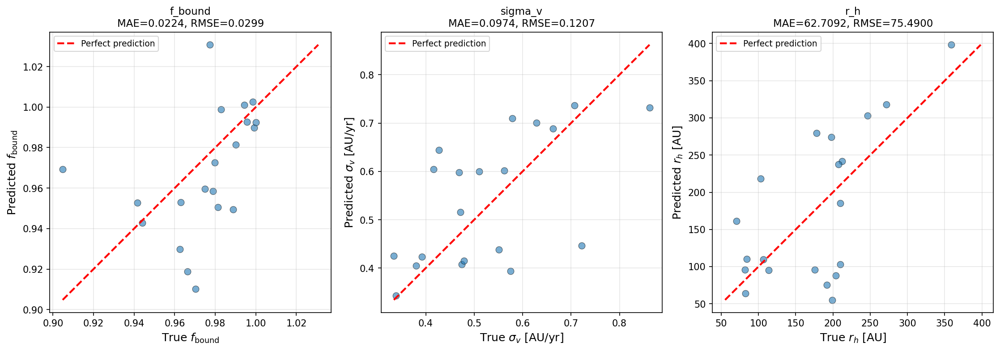
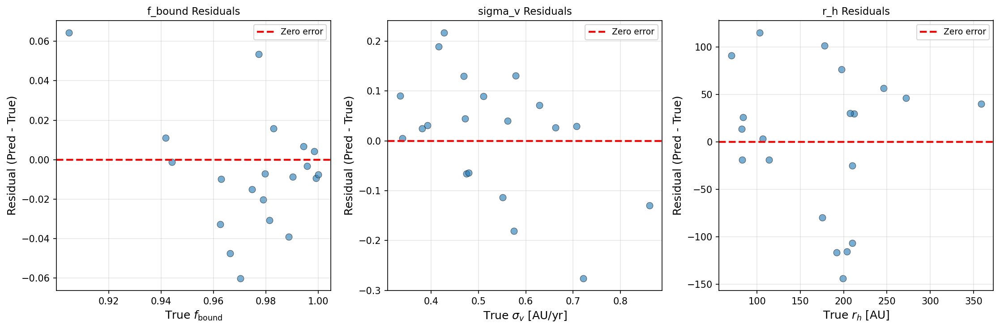
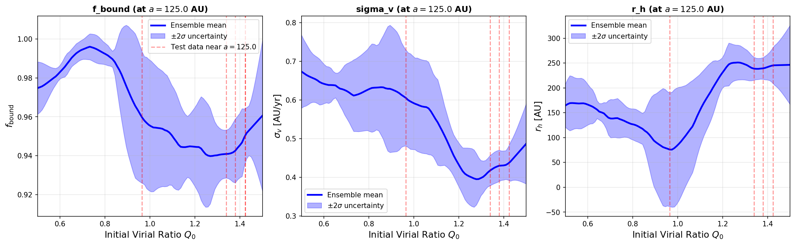
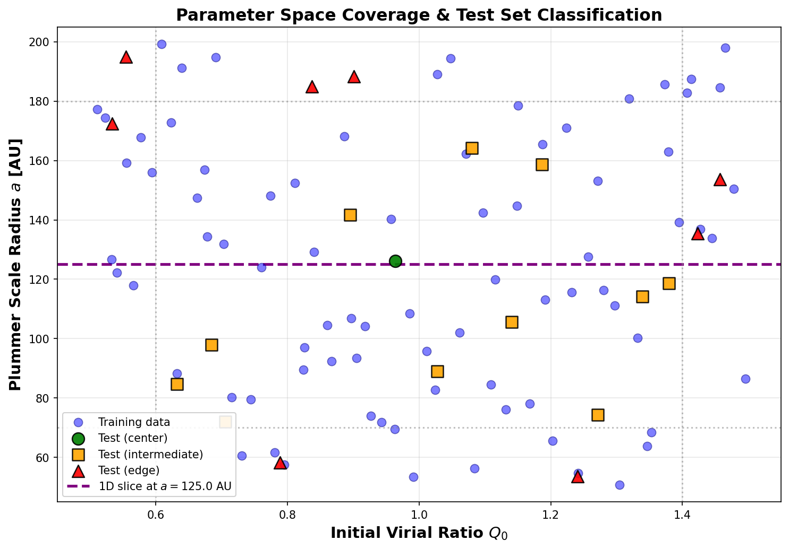
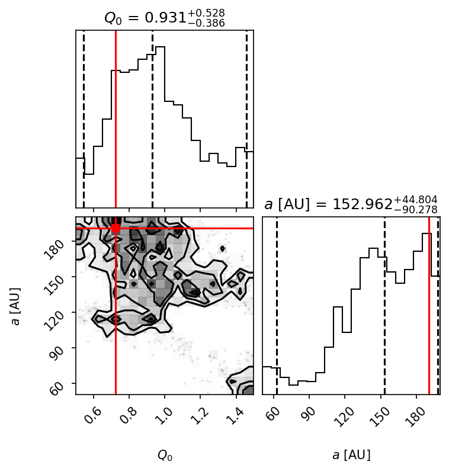

# N-Body Emulator for N-body Star Cluster Dynamics
## *Final Project Research Memo*

**Executive Summary**

In this project, I used the JAX-based leapfrog N-body simulation package that I developed in project 5 to train a neural network. Even with symplectic leapfrog integration, running simulations on 100+ bodies for many timesteps can become prohibitvely time consuming. By generating N-body data to train an emulator on, I was able to build an inference machine that can predict dynamics results in a fraction of the time. I generated 100 samples for emulator training and 30 samples for testing from my project 5 sampling. After training and testing the functionality of my emulator, I created an inference machine that uses NUTS sampling to explore parameter space and predict dynamics outputs for an N-body system. 

**Methodology**

***Generating Training Data***

I first reconfigured my project 5 JAX-based n-body integrator and sampler as the importable Python package ``jax_nbody``. Before proceeding to generating data, I ran tests on my existing package to ensure that it had imported properly and that my sampling worked. In order to set a constant timestep to generate my data, I calculated the crossing time using the relation $t_{cross} \sim \sqrt{a^3 \over {GM}}$, where $a$ is the Plummer scale radius and $M$ is the total mass drawn from the Kroupa IMF. I wrote a script to test the ideal factor of $t_{cross}$ to use to set my $\Delta t$; I tested 0.02, 0.01, and 0.005 and found that $\Delta t = 0.005 \times t_{cross}$ achieved the desired relative energy error of $\sim 10^{-4}$. 

*Figure 1: Relative energy error as a function of time in crossing times. TOP: Factor of 0.01 starts with reasonable error, but quickly drifts to $> 10^{-2}$. BOTTOM: Factor of 0.005 chosen, which shows oscillatory behavior near $\sim 10^{-4}$, with no drift over 10 crossing times. I chose to use $\Delta t = 0.005 \times t_{cross}$.*

I then used Latin Hypercube Sampling (LHS) to effectively cover parameter space when generating my training data. I sampled initial virial ratios, $Q_0$, within the range [0.5, 1.5] and sampled the Plummer scale radius, $a$, within the range [50 $M_{\odot}$, 200 $M_{\odot}$]. I generated and saved 100 samples of training data and saved another 30 samples to use for testing; these were generated separately to ensure the emulator functions ran properly without their performance being artificially inflated by being tested on identical data. I computed summary statistics on the final states produced from my training data, calculating the bound mass fraction, $f_{bound}$, the velocity dispersion, $\sigma _v^2$, and the half-mass radius, $r_h$. With expected values of $f_{bound} \in [0.3 - 1.0]$, $\sigma _v^2 \in [0.5 - 5]$ AU/yr, and $r_h \in [20 - 150]$ AU, I inspected outliers and determined that these extreme outcomes were within a reasonable range and not a symptom of larger issues with the data. 

***Building and Training Emulator***

I first built the Normalizer class to compute and save normalization statistics for the input and output training data. I normalized to zero mean and unit variance to ensure stable training data for the emulator. I then built my NNEMulator class, which contained my true neural network structure. I created a multi-layer perceptron (MLP) neural network architecture, using ``equinox``, starting with an input layer, two hidden layers, and the output. The input layer accepts the normalized data for ($Q_0$, $a$), the two hidden layers each have a size of 64 and use the ReLU activation function ( $ReLU(x) = max(0,x)$ ), and the output layer is linear, producing the three summary statistics desired. Using my NNEmulator as the model base, I trained using five different models, each with different initializations. I used the ``optax`` Adam optimizer and used ``equinox`` for gradient descent computations. I adjusted my hyper parameters to minizmize the loss function, initially starting with a learning rate of $10^{-3}$ and 1000 epochs, and eventually achieving reasonable loss by changing the learning rate to $10^{-2}$ and using 1200 epochs. I ran my training on all 100 sets of training data, retrieving a mean squared error loss of $\sim 0.001$, and saved the models.

*Figure 2: The mean squared error loss function for five different models. Due to random initializations, the curves are not identical, but all sharply decrease, plateauing at $\sim 100$ epochs.*

**Validation**

Before proceeding to inference, I created a thorough test suite to evaluate my emulator using the 30 set testing data that I set aside at that beginning. I first did simple sanity tests, checking that denormalizing normalized data returned the original data, checking that the model outputs had the correct shape, and ensuring that there were no Nan outputs. I then computed accuracy metrics for my emulator's predictions, such as the Mean Absolute Error (MAE) and Root Mean Square Error (RMSE), using the mean value of the predictions to be the predicted value to compare to the test set data (true data). 

*Figure 3: TOP: Predicted values for $f_{bound}$, $\sigma _v^2$, and $r_h$ compared to the "perfect prediction" line, which shows the true values from the test data. We do not expect perfect prediction, but the data does appear to generally follow the same relation. BOTTOM: Residuals from perfect prediction line. Residuals are random and do not show clear trends.*

*Accuracy Metrics*
| Output | MAE | RMSE |
|--------|-----|------|
| f_bound | 0.0207 | 0.0286 |
| σᵥ | 0.1147 | 0.1637 |
| rₕ [AU] | 52.86 | 69.06 |

I then needed to test that uncertainity was being properly determined by my emulator. I took a 1D slixe of my predictions at $a$ = 125 AU and varied $Q_0$ from 0.5 to 1.5. As expected, I found that areas where the data was sparse had larger uncertainty.

*Figure 4: Predictions versus initial virial ratio, $Q_0$, for all three preicted parameters for a 1D slice. The red lines show where in the 1D slice there is training data. As expected, in the regions where there are multiple data points in the slice, there is lower uncertainity, and in the regions where there is only one data point, there is much larger uncertainity.*

Finally, I checked the performance of my emulator at the edges of the parameter space. I defined central, intermediate, and edge regions of the parameter space and compared the uncertainty and errors of predictions in each region. I found that uncertainty stays relatively flat, which means that my emulator is not extrapolating dangerously.

*Figure 5: Plot of training data parameter space coverage. Green points are test data that fall in the center of the region, yellow points fall in the intermediate region, and red points are edge cases.*

*Ensemble Uncertainty by Region*

| Region | $f_{bound}$ σ | σᵥ σ | rₕ σ [AU] | Count |
|--------|-----------|------|-----------|-------|
| Center | 0.0122 | 0.0443 | 21.41 | 3 |
| Intermediate | 0.0092 | 0.0598 | 21.10 | 14 |
| Edge | 0.0105 | 0.0544 | 23.20 | 13 |

*Prediction Errors by Region*

| Region | $f_{bound}$ RMSE | σᵥ RMSE | rₕ RMSE [AU] |
|--------|--------------|---------|--------------|
| Center | 0.0223 | 0.1045 | 18.48 |
| Intermediate | 0.0256 | 0.2055 | 54.20 |
| Edge | 0.0328 | 0.1176 | 88.10 |

**Inference Results**

I used ``numpyro`` and my emulator model as a predictor for my inference model. I used the No-U-Turn Sampler (NUTS) that automatically adjusts the leapfrog integration time within the MCMC algorithm. I used the test set RMSE to be the $\sigma_{obs}$ for my inference model, then ran the inference for 2000 steps. Analyzing the posterior, I found that my inference machine recovers both $Q_0$ and $a$ within the 95% confidence intervals.

*Figure 6: Corner plot of posterior distributions for $Q_0$ and $a$. Black dotted lines represent mean and 95%. Red lines represent true values. The true values lie within the 95% confidence interval, showing that the inference can retrieve true values.*

*Posterior Results*
| Parameter | True Value | Posterior Mean ± Std | 95% Credible Interval | Status |
|-----------|------------|----------------------|----------------------|---------|
| Q₀        | 0.726      | 0.958 ± 0.238       | [0.545, 1.459]       | Recovered |
| a [AU]    | 190.6      | 150.3 ± 33.8        | [62.7, 197.8]        | Recovered |

**Conclusions**

This project successfully demonstrated that neural network emulators can accelerate N-body simulation by several orders of magnitude while maintaining decent accuracy. The ensemble of five neural networks achieved reasonable prediction errors (RMSE < 0.03 for $f_{bound}$​, < 0.17 for $\sigma_v$, < 70 AU for $r_h$​) and properly covered uncertainty through parameter space. The inference pipeline successfully recovered true parameters within 95% credible intervals. By replacing time-expensive simulations with speedy neural network models, this approach reduces inference massively, making comprehensive analysis of N-body systems significantly less costly.