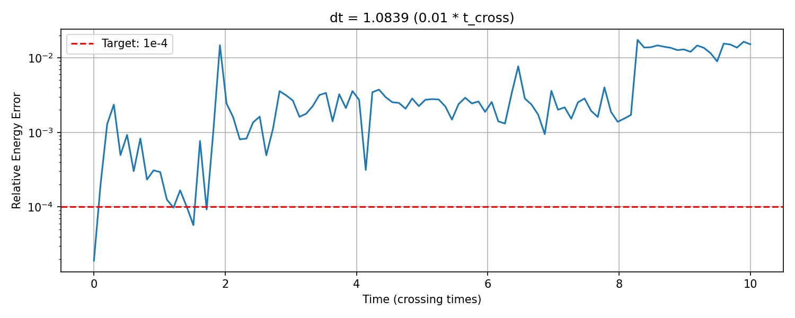
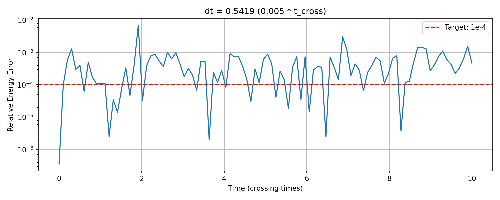
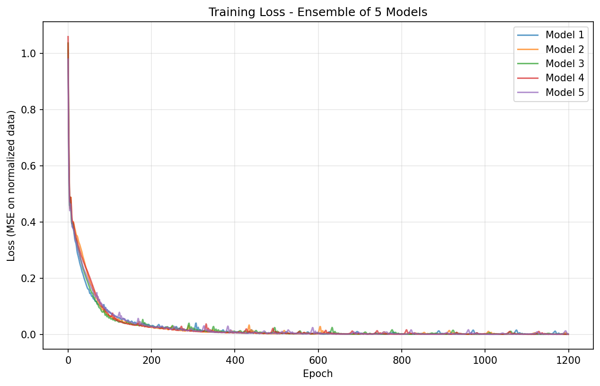

# N-Body Emulator for N-body Star Cluster Dynamics
## *Final Project Research Memo*

**Executive Summary**

In this project, I used the JAX-based leapfrog N-body simulation package that I developed in project 5 to train a neural network. Even with symplectic leapfrog integration, running simulations on 100+ bodies for many timesteps can become prohibitvely time consuming. By generating N-body data to train an emulator on, I was able to build an inference machine that can predict dynamics results in a fraction of the time. I generated 80 samples for emulator training and 20 samples for testing from my project 5 sampling. After training and testing the functionality of my emulator, I created an inference machine that uses NUTS sampling to explore parameter space and predict dynamics outputs for an N-body system. 

**Methodology**

***Generating Training Data***

I first reconfigured my project 5 JAX-based n-body integrator and sampler as the importable Python package ``jax_nbody``. Before proceeding to generating data, I ran tests on my existing package to ensure that it had imported properly and that my sampling worked. In order to set a constant timestep to generate my data, I calculated the crossing time using the relation $t_{cross} \sim \sqrt{a^3 \over {GM}}$, where $a$ is the Plummer scale radius and $M$ is the total mass drawn from the Kroupa IMF. I wrote a script to test the ideal factor of $t_{cross}$ to use to set my $\Delta t$; I tested 0.02, 0.01, and 0.005 and found that $\Delta t = 0.005 \times t_{cross}$ achieved the desired relative energy error of $\sim 10^{-4}$. 

*Figure 1: Relative energy error as a function of time in crossing times. TOP: Factor of 0.01 starts with reasonable error, but quickly drifts to $> 10^{-2}$. BOTTOM: Factor of 0.005 chosen, which shows oscillatory behavior near $\sim 10^{-4}$, with no drift over 10 crossing times. I chose to use $\Delta t = 0.005 \times t_{cross}$.*

I then used Latin Hypercube Sampling (LHS) to effectively cover parameter space when generating my training data. I sampled initial virial ratios, $Q_0$, within the range [0.5, 1.5] and sampled the Plummer scale radius, $a$, within the range [50 $M_{\odot}$, 200 $M_{\odot}$]. I generated and saved 80 samples of training data and saved another 20 samples to use for testing; these were generated separately to ensure the emulator functions ran properly without their performance being artificially inflated by being tested on identical data. I computed summary statistics on the final states produced from my training data, calculating the bound mass fraction, $f_{bound}$, the velocity dispersion, $\sigma _v^2$, and the half-mass radius, $r_h$. With expected values of $f_{bound} \in [0.3 - 1.0]$, $\sigma _v^2 \in [0.5 - 5]$ AU/yr, and $r_h \in [20 - 150]$ AU, I inspected outliers and determined that these extreme outcomes were within a reasonable range and not a symptom of larger issues with the data. 

***Building and Training Emulator***

I first built the Normalizer class to compute and save normalization statistics for the input and output training data. I normalized to zero mean and unit variance to ensure stable training data for the emulator. I then built my NNEMulator class, which contained my true neural network structure. I created a multi-layer perceptron (MLP) neural network architecture, using ``equinox``, starting with an input layer, two hidden layers, and the output. The input layer accepts the normalized data for ($Q_0$, $a$), the two hidden layers each have a size of 64 and use the ReLU activation function ( $ReLU(x) = max(0,x)$ ), and the output layer is linear, producing the three summary statistics desired. Using my NNEmulator as the model base, I trained using five different models, each with different initializations. I used the ``optax`` Adam optimizer and used ``equinox`` for gradient descent computations. I adjusted my hyper parameters to minizmize the loss function, initially starting with a learning rate of $10^{-3}$ and 1000 epochs, and eventually achieving reasonable loss by changing the learning rate to $10^{-2}$ and using 1200 epochs. I ran my training on all 80 sets of training data, retrieving a mean squared error loss of $\sim 0.003$.

*Figure 2: The mean squared error loss function for five different models. Due to random initializations, the curves are not identical, but all sharply decrease, plateauing at $\sim 150$ epochs.*

